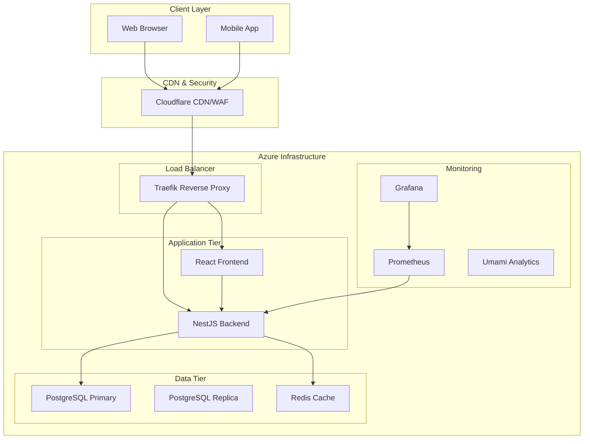
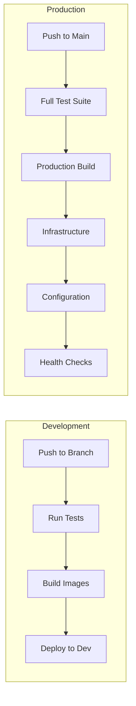

# Pro-Mata Infrastructure

Infrastructure as Code for the Pro-Mata application using Terraform and Ansible on Azure.

## 📖 Documentation

- **[Architecture Documentation](ARCH.md)** - Complete system architecture, components, and deployment details
- **[Quick Start Guide](#quick-start)** - Get up and running in minutes
- **[CI/CD Guide](#cicd-pipeline)** - Automated deployment workflows

## What This Does

- **Infrastructure**: Provisions Azure VMs, networking, and storage with Terraform
- **Configuration**: Sets up Docker Swarm cluster with Ansible
- **Deployment**: Automated CI/CD pipeline via GitHub Actions
- **Services**: Deploys frontend, backend, database, and monitoring stack

## Architecture Overview



> 📋 **See [ARCH.md](ARCH.md) for complete architecture documentation**

## Quick Start

### Prerequisites

- Azure subscription with Service Principal credentials
- GitHub repository secrets configured (see below)

### Required Secrets

```plain
AZURE_CREDENTIALS          # Service Principal JSON
AZURE_SUBSCRIPTION_ID      # Azure subscription ID
ANSIBLE_VAULT_PASSWORD     # Vault encryption key
CLOUDFLARE_API_TOKEN       # Optional: DNS management
CLOUDFLARE_ZONE_ID         # Optional: DNS zone
```

### Deploy

**Manual Deployment:**

1. Go to Actions → "Pro-Mata Unified Deployment"
2. Click "Run workflow"
3. Select environment (dev/prod) and action (deploy)

**Automatic Deployment:**

- Push to `main` branch triggers dev deployment
- External webhook via repository dispatch

### Local Development

```bash
# Deploy dev environment
make deploy-automated ENV=dev

# Check status
make quick-status ENV=dev

# Health check
make health ENV=dev

# Destroy (careful!)
make destroy-dev
```

## System Components

| Component | Technology | Access | Purpose |
|-----------|-----------|--------|---------|
| **Frontend** | React + Vite | <https://promata.com.br> | User interface |
| **Backend** | NestJS + Node.js | <https://api.promata.com.br> | Business logic & API |
| **Database** | PostgreSQL 15 | Internal | Primary data store |
| **Cache** | Redis 7 | Internal | Session & data cache |
| **Proxy** | Traefik v3 | <https://traefik.promata.com.br> | Load balancer & SSL |
| **Monitoring** | Prometheus + Grafana | <https://grafana.promata.com.br> | System monitoring |
| **Analytics** | Umami | <https://analytics.promata.com.br> | Web analytics |
| **Database Admin** | PgAdmin 4 | <https://pgadmin.promata.com.br> | DB management |

## CI/CD Pipeline

Our automated deployment pipeline ensures reliable, consistent deployments:



> 📋 **See [CI/CD Documentation](ARCH.md#cicd-pipeline) for detailed workflow information**

## Monitoring

- **System Metrics**: <https://grafana.promata.com.br>
- **Application Logs**: <https://prometheus.promata.com.br>
- **Uptime Status**: <https://traefik.promata.com.br>
- **Web Analytics**: <https://analytics.promata.com.br>

## Security

- **Secrets Management**: Ansible Vault + Azure Key Vault
- **Authentication**: Service Principal + SSH keys
- **Network Security**: Azure NSG rules
- **SSL/TLS**: Let's Encrypt certificates via Traefik
- **Edge Protection**: Cloudflare WAF and DDoS protection

> 📋 **See [Security Architecture](ARCH.md#security-architecture) for detailed security measures**

## Environments

| Environment | Purpose | Auto-Deploy | Manual Approval |
|-------------|---------|-------------|----------------|
| **Development** | Feature testing | ✅ Push to dev branch | ❌ |
| **Staging** | Pre-production testing | ✅ Push to staging branch | ❌ |
| **Production** | Live system | ❌ | ✅ Required |

## For Beginners - Simple Instructions

### How to Deploy (Easy Way)

1. Go to the **Actions** tab in this GitHub repo
2. Click **"Pro-Mata Unified Deployment"**
3. Click **"Run workflow"** button
4. Choose:
   - **Environment**: `dev` (for testing) or `prod` (for live site)
   - **Action**: `deploy` (to build everything)
5. Click **"Run workflow"** - wait ~15 minutes

That's it! The system will create cloud servers and make the website live.

### Check If It's Working

After deployment, visit these URLs:

- **Main site**: <https://promata.com.br>
- **API health**: <https://api.promata.com.br/health>
- **System status**: <https://grafana.promata.com.br>

### Troubleshooting for Beginners

- **Deployment failed?** Check the Actions tab for error messages
- **Website not loading?** Wait 5-10 minutes after deployment completes
- **Need help?** Ask the infrastructure team or check the [Architecture Documentation](ARCH.md)

## Development Workflow

### Local Development and Setup

```bash
# 1. Clone the infrastructure repository
git clone <this-repo>

# 2. Setup local environment
make dev-init

# 3. Deploy development stack
make dev-deploy

# 4. Monitor deployment
make logs ENV=dev
```

### Making Changes

1. **Create a feature branch** from `dev`
2. **Make your changes** to Terraform/Ansible files
3. **Test locally** with `make validate ENV=dev`
4. **Push to your branch** - automatic dev deployment
5. **Create a pull request** to `main` for production

### Secret Management

```bash
# Setup vault password (first time only)
./scripts/vault/vault-easy.sh setup

# Edit secrets for development
./scripts/vault/vault-easy.sh edit envs/dev/secrets/all.yml

# Edit secrets for production
./scripts/vault/vault-easy.sh edit envs/prod/secrets/all.yml
```

## Common Tasks

### Infrastructure Management

```bash
# Deploy specific environment
make deploy-automated ENV=dev

# Check system health
make health ENV=dev

# View deployment logs
make logs ENV=dev

# Clean up resources (careful!)
make destroy-dev
```

### Database Operations

```bash
# Connect to database
docker exec -it <postgres-container> psql -U postgres -d promata

# Create backup
./scripts/backup/backup-database.sh dev

# Restore from backup
./scripts/backup/restore-database.sh dev backup-file.sql
```

### Monitoring and Debugging

```bash
# Check container status
docker service ls

# View service logs
docker service logs promata-dev_backend

# Monitor resource usage
docker stats

# Test API endpoints
curl https://api.promata.com.br/health
```

## Important Notes

⚠️ **Never run commands with `destroy` unless you know what you're doing**
⚠️ **Production deployments should be reviewed by the team first**
⚠️ **Always test changes in development environment first**
✅ **Development environment is safe to experiment with**
✅ **All secrets are encrypted and stored securely**

## Support

- **Documentation**: [ARCH.md](ARCH.md) - Complete architecture guide
- **Issues**: Create a GitHub issue for bugs or feature requests
- **Emergency**: Contact the infrastructure team for production issues
- **Questions**: Use GitHub Discussions for general questions

---

## Built with ❤️ for Centro de Pesquisas e Proteção da Natureza (CPPN) Pró-Mata - PUCRS**
