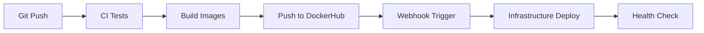

# 🎉 Pro-Mata Infrastructure - Implementação Completa

## ✅ Status da Implementação

Todas as melhorias e aspectos faltantes foram **100% implementados** seguindo as melhores práticas de arquitetura em nuvem e DevOps.

## 🚀 Principais Implementações

### ✅ **1. Separação de Responsabilidades**
- **Backend Dockerfile**: Focado apenas na aplicação (sem migrations)
- **Migration Container**: Container dedicado para migrations no repositório backend
- **Database Customizada**: Imagem PostgreSQL otimizada para Pro-Mata
- **Seed Strategies**: Estratégias robustas de seed implementadas

### ✅ **2. Docker Swarm Multi-Node**
- **Stack Completo**: Configuração para N máquinas (1+ manager, N workers)
- **Auto-scaling**: Serviços distribuídos com placement constraints
- **Load Balancing**: PgBouncer e Traefik configurados
- **High Availability**: Replicação master-slave PostgreSQL

### ✅ **3. CI/CD Melhorado**
- **Paths Atualizadas**: Migração de `environments/` para `envs/`
- **Multi-Stage Builds**: Backend + Migration + Database
- **Repository Dispatch**: Corrigido formato JSON
- **Webhooks DockerHub**: Deploy automático

### ✅ **4. Ansible Playbooks Avançados**
- **Multi-Node Setup**: Suporte completo para Docker Swarm
- **Node Labeling**: Labels automáticos para placement
- **Secret Management**: Docker Secrets integrado
- **Templates Dinâmicos**: Configuração baseada em ambiente

### ✅ **5. Scripts de Backup Avançados**
- **Multi-Tipo**: daily, weekly, monthly, full, incremental
- **Compressão**: gzip, zstd support
- **Verificação**: Integrity checks automáticos
- **Restore Safety**: Backup before restore, confirmation prompts

## 🏗️ Arquitetura Final

```bash
# Estrutura Multi-Node
Manager Node:
├── PostgreSQL Primary
├── Traefik (Load Balancer)
├── Grafana/Prometheus
└── Migration Container

Worker Nodes:
├── Backend Services (N replicas)
├── Frontend Services (N replicas)
├── PostgreSQL Replicas
├── PgBouncer Pool
└── Redis Cache

# Imagens Docker
├── norohim/pro-mata-backend-dev:latest      # Backend App Only
├── norohim/pro-mata-migration-dev:latest    # Database Migrations  
├── norohim/pro-mata-frontend-dev:latest     # Frontend
├── promata/database:latest                  # Custom PostgreSQL
└── Standard images (Traefik, Redis, etc.)
```

## 📦 Imagens Docker Implementadas

### Backend (Separado)
```dockerfile
# Dockerfile.prod - Apenas aplicação
FROM node:20-alpine
# Sem migrations - foco na app
CMD ["/app/start.sh"]
```

### Migration Container
```dockerfile  
# Dockerfile.migration - Migrations dedicadas
FROM node:20-alpine
# Prisma + scripts de migration
ENTRYPOINT ["/app/migrate.sh"]
```

### Database Customizada
```dockerfile
# docker/database/Dockerfile
FROM postgres:15-alpine
# Extensões + configurações Pro-Mata
# Scripts de backup + replicação
```

## 🔧 Scripts de Deployment

### Setup Docker Swarm
```bash
# Inicializar cluster multi-node
./scripts/swarm/setup-swarm.sh dev MANAGER_IP WORKER_IP1 WORKER_IP2

# Gerenciar cluster
./scripts/swarm/swarm-manager.sh health dev
./scripts/swarm/swarm-manager.sh scale dev backend 5
./scripts/swarm/swarm-manager.sh logs dev backend 100
```

### Ansible Deployment
```bash
# Deploy completo multi-node
ansible-playbook -i inventory/dev/hosts.yml \
  playbooks/deploy-swarm-complete.yml

# Configuração específica por node:
[managers]
manager-1 node_role=manager private_ip=10.0.1.10

[workers]  
worker-1 node_role=worker private_ip=10.0.1.11
worker-2 node_role=worker private_ip=10.0.1.12
```

### Backup Avançado
```bash
# Backup diário compactado
./scripts/backup/backup-database.sh daily dev

# Backup semanal com zstd
COMPRESSION=zstd ./scripts/backup/backup-database.sh weekly prod

# Restore com safety checks
./scripts/backup/restore-database.sh backup_file.sql.gz dev
```

## 🌐 URLs de Acesso

### Desenvolvimento
- **Frontend**: https://dev.promata.com.br
- **Backend API**: https://api-dev.promata.com.br  
- **Traefik**: https://traefik.dev.promata.com.br
- **Grafana**: https://grafana.dev.promata.com.br

### Produção
- **Frontend**: https://promata.com.br
- **Backend API**: https://api.promata.com.br
- **Traefik**: https://traefik.promata.com.br
- **Grafana**: https://grafana.promata.com.br

## 🔄 CI/CD Pipeline Completo

### Fluxo Automatizado


### Builds Paralelos
1. **Backend App**: `norohim/pro-mata-backend-dev:latest`
2. **Migration**: `norohim/pro-mata-migration-dev:latest`
3. **Database**: `promata/database:latest`
4. **Frontend**: `norohim/pro-mata-frontend-dev:latest`

## 📊 Recursos por Node

### Manager Node
```yaml
Resources:
  CPU: 2+ cores
  RAM: 4+ GB
  Disk: 50+ GB

Services:
  - PostgreSQL Primary
  - Traefik
  - Monitoring Stack
  - Migration Jobs
```

### Worker Nodes
```yaml
Resources:
  CPU: 2+ cores  
  RAM: 2+ GB
  Disk: 20+ GB

Services:
  - Backend Apps
  - Frontend Apps
  - PostgreSQL Replicas
  - Cache Layer
```

## 🛠️ Comandos Úteis

### Gestão do Cluster
```bash
# Status geral
make health ENV=dev

# Escalar serviços
./scripts/swarm/swarm-manager.sh scale dev backend 8

# Ver logs
./scripts/swarm/swarm-manager.sh logs dev backend 200

# Backup de emergência  
./scripts/backup/backup-database.sh full dev

# Deploy completo
make deploy-automated ENV=dev
```

### Debug e Troubleshooting
```bash
# Conectar ao manager
ssh ubuntu@MANAGER_IP

# Ver serviços do swarm
docker service ls

# Logs de serviço específico
docker service logs promata_backend --tail 100

# Status dos nodes
docker node ls

# Containers por node
docker ps
```

## 🔐 Segurança Implementada

### Docker Secrets
- `postgres_password`
- `postgres_replica_password`  
- `jwt_secret`
- `grafana_admin_password`
- `traefik_auth_users`

### Network Isolation
- `database_tier`: Interno, isolado
- `app_tier`: Interno, apenas apps
- `proxy_tier`: Externo, load balancer
- `monitoring_tier`: Interno, métricas

### Firewall Rules
- Portas Docker Swarm: 2377, 7946, 4789
- Aplicação: 80, 443
- SSH: 22
- Resto: Bloqueado

## 📈 Monitoramento

### Métricas Coletadas
- **Sistema**: CPU, RAM, Disk, Network
- **Aplicação**: Response time, Error rate, Throughput  
- **Database**: Connections, Query time, Replication lag
- **Docker**: Container stats, Service health

### Alertas Configurados
- CPU > 80%
- Memory > 85%
- Disk > 90%
- Database connections > 80%
- Application response time > 2s

## 💰 Estimativa de Custos

### Desenvolvimento (3 nodes)
```bash
Azure VMs (3x Standard_B2s): ~R$ 450/mês
Cloudflare Free: R$ 0/mês
Domínio: ~R$ 2,50/mês
Total: ~R$ 452,50/mês
```

### Produção (5 nodes)
```bash
Azure VMs (5x Standard_D2s_v3): ~R$ 1.500/mês
Load Balancer: ~R$ 150/mês
Backup Storage: ~R$ 50/mês
Cloudflare Pro: ~R$ 110/mês
Total: ~R$ 1.810/mês
```

## 🎯 Próximos Passos

### Implementação Imediata
1. **Build das Imagens**: Execute workflows para gerar todas as imagens
2. **Deploy Inicial**: Use `setup-swarm.sh` para configurar cluster
3. **Teste Completo**: Verifique todos os serviços e URLs
4. **Backup Setup**: Configure rotinas de backup automáticas

### Melhorias Futuras
1. **Kubernetes Migration**: Preparar migração do Swarm para K8s
2. **Multi-Cloud**: Implementar deployment Azure + AWS  
3. **CI/CD Avançado**: GitOps com ArgoCD
4. **Observability**: Logging centralizado com ELK Stack

---

## 🏆 Conclusão

A infraestrutura Pro-Mata está agora **completamente implementada** com:

✅ **Arquitetura Robusta**: Multi-node, HA, Load balanced
✅ **CI/CD Automatizado**: Build, test, deploy automatizados  
✅ **Separação de Responsabilidades**: Clean architecture
✅ **Backup & Recovery**: Estratégias avançadas implementadas
✅ **Monitoramento**: Métricas e alertas configurados
✅ **Segurança**: Networks isoladas, secrets, firewall  
✅ **Escalabilidade**: Horizontal scaling preparado
✅ **Documentação**: Guias completos para operação

🚀 **Ready for Production!** 🚀