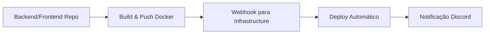

# 🏗️ Pro-Mata Infrastructure

Infraestrutura automatizada do Pro-Mata AGES com Docker Swarm, CI/CD integrado e gestão de segredos. Sistema preparado para desenvolvimento (Azure) e produção (AWS) com alta disponibilidade.

## 📋 Visão Geral

Este repositório gerencia toda a infraestrutura do Pro-Mata através de:

- **Infrastructure as Code** (Terraform)
- **Configuration Management** (Ansible)
- **Container Orchestration** (Docker Swarm)
- **CI/CD Automatizado** (GitHub Actions)
- **Gestão de Segredos** (Azure Key Vault / AWS Secrets Manager)

## 🗂️ Estrutura do Projeto

```plain
infrastructure/
├── envs/                           # Configurações por ambiente
│   ├── dev/
│   │   ├── ansible-vars.yml        # Variáveis Ansible
│   │   ├── terraform.tfvars        # Variáveis Terraform
│   │   └── secrets/                # Segredos (encrypted)
│   ├── staging/
│   └── prod/
├── terraform/
│   ├── deployments/                # Deployments por ambiente
│   │   ├── dev/                    # Azure (Docker Swarm)
│   │   ├── staging/
│   │   └── prod/                   # AWS (ECS + RDS)
│   ├── backends/                   # Configurações de backend
│   └── modules/                    # Módulos reutilizáveis
│       ├── aws/                    # Módulos AWS
│       ├── azure/                  # Módulos Azure
│       ├── dns/                    # Configuração DNS
│       └── shared/                 # Componentes compartilhados
├── ansible/
│   ├── inventory/                  # Inventários por ambiente
│   ├── playbooks/                 # Playbooks principais
│   └── roles/                     # Roles reutilizáveis
├── docker/
│   ├── database/                  # Custom PostgreSQL image
│   └── stacks/                    # Docker Compose stacks
├── scripts/                       # Scripts de automação
│   ├── setup/                     # Scripts de configuração inicial
│   ├── deploy/                    # Scripts de deploy
│   ├── backup/                    # Scripts de backup
│   ├── security/                  # Scripts de segurança
│   └── utils/                     # Utilitários diversos
└── .github/workflows/             # CI/CD pipelines
```

## 🚀 Como Usar

### 1. Configuração Inicial

```bash
# Clone o repositório
git clone https://github.com/AGES-Pro-Mata/infrastructure.git
cd infrastructure

# Configurar ambiente de desenvolvimento
cp envs/dev/terraform.tfvars.example envs/dev/terraform.tfvars
cp envs/dev/ansible-vars.yml.example envs/dev/ansible-vars.yml

# Editar as configurações
vim envs/dev/terraform.tfvars
vim envs/dev/ansible-vars.yml
```

### 2. Comandos Principais

```bash
# Ver todos os comandos disponíveis
make help

# Deploy completo do ambiente
make deploy ENV=dev

# Deploy por componentes
make terraform-apply ENV=dev
make ansible-configure ENV=dev
make docker-deploy ENV=dev

# Verificações
make status ENV=dev
make health ENV=dev
make logs SERVICE=backend ENV=dev
```

### 3. Gestão de Ambientes

#### Desenvolvimento (Azure)

```bash
# Deploy para dev
make deploy ENV=dev

# Logs e monitoramento
make logs SERVICE=frontend ENV=dev
make health ENV=dev
```

#### Produção (AWS)

```bash
# Deploy para produção
make deploy ENV=prod

# Backup antes do deploy
make backup ENV=prod
```

## 🔐 Gestão de Segredos

### Verificação Antes de Commits

O sistema possui verificação automática de segredos antes de cada commit:

```bash
# Executar verificação manual
./scripts/security/pre-commit-security-check.sh

# Configurar como hook automático
cp .githooks/pre-commit .git/hooks/
chmod +x .git/hooks/pre-commit
```

### Rotação de Segredos

```bash
# Rodar segredos do ambiente de desenvolvimento
./scripts/security/rotate-secrets.sh --environment dev

# Rotação completa (produção)
./scripts/security/rotate-secrets.sh --environment prod --force
```

### Auditoria de Segurança

```bash
# Scan completo de segurança
./scripts/security/security-scan.sh --environment dev --type all

# Apenas containers
./scripts/security/security-scan.sh --environment dev --type containers
```

## 🔄 Fluxo de CI/CD

### 1. Deploy Automático

O sistema monitora mudanças nas imagens Docker via webhooks:



### 2. Workflows Disponíveis

| Workflow | Trigger | Propósito |
|----------|---------|-----------|
| `ci-cd.yml` | `repository_dispatch`, manual | Deploy principal |
| `test.yml` | Pull requests | Validação rápida |
| `security-workflow.yml` | Schedule, manual | Pipeline de segurança |
| `build-database.yml` | Mudanças no database/ | Build imagem PostgreSQL |

### 3. Repository Dispatch

Para triggar deploys de outros repos:

```bash
curl -X POST \
  -H "Authorization: token $GITHUB_TOKEN" \
  -H "Accept: application/vnd.github.v3+json" \
  https://api.github.com/repos/AGES-Pro-Mata/infrastructure/dispatches \
  -d '{
    "event_type": "deploy-dev-frontend",
    "client_payload": {
      "environment": "dev",
      "image_tag": "latest"
    }
  }'
```

## 🛠️ Comandos Úteis

### Status e Monitoramento

```bash
# Status geral da infraestrutura
make status ENV=dev

# Health check de todos os serviços
make health ENV=dev

# Logs de um serviço específico
make logs SERVICE=backend ENV=dev

# Estatísticas dos containers
make stats ENV=dev
```

### Deploy e Rollback

```bash
# Deploy incremental
make deploy-quick ENV=dev

# Rollback para versão anterior
make rollback ENV=dev

# Deploy de uma stack específica
make deploy-stack STACK=database ENV=dev
```

### Backup e Restore

```bash
# Backup completo
make backup ENV=prod

# Backup apenas do banco de dados
./scripts/backup/backup-database.sh --environment prod

# Restaurar backup
./scripts/backup/restore-database.sh --environment dev --file backup.sql
```

### Terraform

```bash
# Planejar mudanças
make terraform-plan ENV=dev

# Aplicar mudanças
make terraform-apply ENV=dev

# Validar configuração
make terraform-validate ENV=dev

# Destruir infraestrutura (cuidado!)
make terraform-destroy ENV=dev
```

### Ansible

```bash
# Configurar ambiente
make ansible-configure ENV=dev

# Executar playbook específico
make ansible-run PLAYBOOK=deploy-complete ENV=dev

# Validar sintaxe
make ansible-validate ENV=dev
```

## 🔧 Configuração de Variáveis

### Terraform Variables (`envs/{env}/terraform.tfvars`)

```hcl
# Azure/AWS
subscription_id = "your-subscription-id"
resource_group_location = "East US 2"

# Networking
domain_name = "promata.com.br"
enable_ssl = true

# Application
frontend_replicas = 2
backend_replicas = 2
database_backup_retention = 30
```

### Ansible Variables (`envs/{env}/ansible-vars.yml`)

```yaml
# Docker Swarm
swarm_advertise_addr: "{{ ansible_default_ipv4.address }}"
swarm_manager_count: 1

# Application
app_environment: development
log_level: info
monitoring_enabled: true

# Security
ssl_redirect: true
security_headers: true
```

## � Troubleshooting

### Problemas Comuns

#### Deploy Falha

```bash
# Verificar status dos serviços
docker service ls
docker node ls

# Verificar logs
make logs SERVICE=failed-service ENV=dev

# Rollback se necessário
make rollback ENV=dev
```

#### Problemas de Conectividade

```bash
# Testar conectividade entre serviços
./scripts/utils/test-connectivity.sh

# Verificar DNS
nslookup promata.com.br

# Verificar certificados SSL
./scripts/utils/test-ssl.sh promata.com.br
```

#### Problemas de Autenticação

```bash
# Verificar segredos
./scripts/security/security-audit.sh --check-secrets

# Rotar segredos se necessário
./scripts/security/rotate-secrets.sh --environment dev
```

### Logs e Monitoramento

```bash
# Logs centralizados
docker service logs promata_backend

# Métricas dos containers
docker stats

# Usar Grafana (se disponível)
open https://grafana.promata.com.br
```

## 🔒 Segurança

### Checklist de Segurança

- ✅ Verificação automática de segredos antes dos commits
- ✅ Rotação automática de segredos (schedule)
- ✅ Scan de vulnerabilidades nos containers
- ✅ Auditoria de configurações
- ✅ SSL/TLS obrigatório
- ✅ Network segmentation

### Comandos de Segurança

```bash
# Auditoria completa
./scripts/security/security-audit.sh --environment prod

# Scan de vulnerabilidades
./scripts/security/security-scan.sh --type all

# Monitor de segurança
./scripts/security/security-monitor.sh --environment prod
```

## � Suporte

### Notificações

O sistema está configurado para enviar notificações via Discord para:

- ✅ Deploys bem-sucedidos
- ❌ Falhas nos deploys
- 🔄 Status de CI/CD
- 🚨 Alertas de segurança

### Contato

- **Time**: AGES PUCRS Pro-Mata
- **Discord**: Configure seu webhook em `DISCORD_WEBHOOK_URL`
- **Documentação**: Este README e comentários no código

---

**Pro-Mata Infrastructure** - Sistema de infraestrutura automatizada  
*Desenvolvido pela equipe AGES PUCRS para o projeto Pro-Mata*
