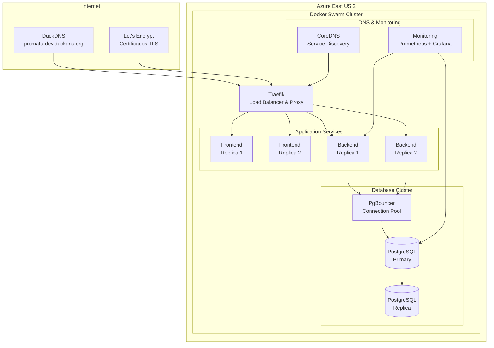

# 🏗️ Pro-Mata Infrastructure

Repositório de infraestrutura do projeto Pro-Mata AGES com automação completa de DevOps, DNS dinâmico, alta disponibilidade e tolerância a falhas.

## 🌟 Arquitetura do Ambiente de Desenvolvimento

### 🎯 Azure for Students - Docker Swarm HA



## 🚀 Quick Start

### 1. Pré-requisitos

```bash
# Ferramentas necessárias
terraform --version  # >= 1.8.0
ansible --version    # >= 8.5.0
az --version         # Azure CLI
docker --version     # >= 24.0.0

# Autenticação Azure
az login
az account set --subscription "Azure for Students"
```

### 2. Configuração Inicial

```bash
git clone https://github.com/AGES-Pro-Mata/infrastructure.git
cd infrastructure

# Configurar variáveis de desenvolvimento
cp environments/dev/.env.dev.example environments/dev/.env.dev
# Editar com suas configurações específicas

# Configurar DuckDNS token
cp environments/dev/duckdns.env.example environments/dev/duckdns.env
```

### 3. Deploy Automatizado

```bash
# Deploy completo da infraestrutura
make deploy-dev

# Ou passo a passo:
make terraform-apply-dev
make ansible-configure-dev
make swarm-deploy-dev
```

## 📁 Nova Estrutura do Repositório

```plain
infrastructure/
├── README.md                     # Este arquivo
├── Makefile                      # Comandos de automação
├── 
├── terraform/
│   ├── modules/
│   │   ├── azure-vm-swarm/       # VMs para Docker Swarm
│   │   ├── networking/           # VNet, NSG, DNS
│   │   ├── storage/              # Discos e volumes
│   │   └── monitoring/           # Log Analytics
│   ├── environments/
│   │   ├── dev/                  # Azure for Students
│   │   └── prod/                 # AWS (futuro)
│   └── providers.tf
│
├── ansible/
│   ├── playbooks/
│   │   ├── swarm-init.yml        # Inicializar Docker Swarm
│   │   ├── database-ha.yml       # PostgreSQL HA + PgBouncer
│   │   ├── traefik-setup.yml     # Traefik com Let's Encrypt
│   │   ├── coredns-setup.yml     # CoreDNS para service discovery
│   │   ├── monitoring.yml        # Prometheus + Grafana
│   │   └── duckdns-updater.yml   # DuckDNS automation
│   ├── roles/
│   │   ├── docker-swarm/
│   │   ├── postgresql-ha/
│   │   ├── pgbouncer/
│   │   ├── traefik/
│   │   ├── coredns/
│   │   └── monitoring/
│   └── inventory/
│       └── dev/
│
├── docker/
│   ├── stacks/
│   │   ├── app-stack.yml         # Frontend + Backend
│   │   ├── database-stack.yml    # PostgreSQL HA + PgBouncer
│   │   ├── proxy-stack.yml       # Traefik
│   │   ├── dns-stack.yml         # CoreDNS
│   │   └── monitoring-stack.yml  # Observabilidade
│   ├── configs/
│   │   ├── traefik/
│   │   ├── postgresql/
│   │   ├── pgbouncer/
│   │   └── coredns/
│   └── compose/
│
├── scripts/
│   ├── deploy.sh                 # Script principal de deploy
│   ├── duckdns-updater.sh        # Atualização DNS automática
│   ├── backup-database.sh        # Backup PostgreSQL
│   ├── health-check.sh           # Health checks
│   ├── ssl-renewal.sh            # Renovação SSL
│   └── rollback.sh               # Rollback de deployments
│
├── environments/
│   ├── dev/
│   │   ├── .env.dev
│   │   ├── duckdns.env
│   │   ├── terraform.tfvars
│   │   └── ansible-vars.yml
│   └── prod/
│
├── monitoring/
│   ├── prometheus/
│   ├── grafana/
│   └── alerts/
│
└── docs/
    ├── SETUP.md
    ├── ARCHITECTURE.md
    ├── TROUBLESHOOTING.md
    └── RUNBOOK.md
```

## 🔧 Componentes da Arquitetura

### 🌐 DNS & Networking

- **DuckDNS**: DNS dinâmico gratuito (`promata-dev.duckdns.org`)
- **CoreDNS**: Service discovery interno do Docker Swarm
- **Traefik**: Proxy reverso moderno com descoberta automática de serviços

### 🐳 Containerização

- **Docker Swarm**: Orquestração nativa simples e eficiente
- **Stacks**: Separação lógica por funcionalidade (app, db, proxy, monitoring)

### 🗄️ Database HA

- **PostgreSQL Primary**: Instância principal com replicação streaming
- **PostgreSQL Replica**: Réplica síncrona para leitura e failover
- **PgBouncer**: Pool de conexões inteligente

### 🔒 Segurança & TLS

- **Let's Encrypt**: Certificados SSL/TLS automáticos
- **Traefik**: Renovação automática de certificados
- **Azure NSG**: Firewall de rede com regras específicas

### 📊 Observabilidade

- **Prometheus**: Coleta de métricas
- **Grafana**: Dashboards visuais
- **Traefik**: Logs de acesso centralizados

## ⚙️ Configuração Detalhada

### 📝 Variáveis de Ambiente (.env.dev)

```bash
# === AZURE CONFIGURATION ===
AZURE_SUBSCRIPTION_ID=sua-subscription-id
AZURE_RESOURCE_GROUP=rg-promata-dev
AZURE_LOCATION=eastus2
VM_SIZE=Standard_B2s

# === DNS CONFIGURATION ===
DOMAIN_NAME=promata-dev.duckdns.org
DUCKDNS_TOKEN=seu-duckdns-token
DUCKDNS_DOMAIN=promata-dev

# === APPLICATION CONFIGURATION ===
ENVIRONMENT=development
BACKEND_IMAGE=norohim/pro-mata-backend-dev:latest
FRONTEND_IMAGE=norohim/pro-mata-frontend-dev:latest

# === DATABASE CONFIGURATION ===
POSTGRES_DB=promata_dev
POSTGRES_USER=promata_user
POSTGRES_PASSWORD=secure_password_here
POSTGRES_REPLICA_USER=replicator
POSTGRES_REPLICA_PASSWORD=replica_password_here

# === PGBOUNCER CONFIGURATION ===
PGBOUNCER_POOL_SIZE=10
PGBOUNCER_MAX_CLIENT_CONN=50

# === TRAEFIK CONFIGURATION ===
TRAEFIK_API_DASHBOARD=true
TRAEFIK_API_INSECURE=false
ACME_EMAIL=seu-email@exemplo.com

# === MONITORING CONFIGURATION ===
GRAFANA_ADMIN_PASSWORD=admin_password
PROMETHEUS_RETENTION=15d
```

### 🔨 Makefile - Comandos de Automação

```makefile
.PHONY: help deploy-dev terraform-* ansible-* swarm-*

help:
    @echo "🏗️  Pro-Mata Infrastructure Commands"
    @echo ""
    @echo "🚀 Main Commands:"
    @echo "  deploy-dev              Complete dev environment deployment"
    @echo "  destroy-dev             Destroy dev environment"
    @echo "  status                  Show infrastructure status"
    @echo ""
    @echo "🏗️  Terraform Commands:"
    @echo "  terraform-init-dev      Initialize Terraform for dev"
    @echo "  terraform-plan-dev      Plan Terraform changes"
    @echo "  terraform-apply-dev     Apply Terraform changes"
    @echo ""
    @echo "⚙️  Ansible Commands:"
    @echo "  ansible-configure-dev   Configure VMs with Ansible"
    @echo "  ansible-update-dev      Update configurations"
    @echo ""
    @echo "🐳 Docker Swarm Commands:"
    @echo "  swarm-deploy-dev        Deploy application stack"
    @echo "  swarm-update-dev        Update services"
    @echo "  swarm-logs             Show service logs"

# Main deployment command
deploy-dev: terraform-apply-dev ansible-configure-dev swarm-deploy-dev dns-update

# Terraform commands
terraform-init-dev:
    cd terraform/environments/dev && terraform init

terraform-plan-dev:
    cd terraform/environments/dev && terraform plan -var-file="../../environments/dev/terraform.tfvars"

terraform-apply-dev:
    cd terraform/environments/dev && terraform apply -var-file="../../environments/dev/terraform.tfvars" -auto-approve

# Ansible commands
ansible-configure-dev:
    cd ansible && ansible-playbook -i inventory/dev playbooks/site.yml

# Docker Swarm commands
swarm-deploy-dev:
    ./scripts/deploy-stacks.sh dev

# DNS update
dns-update:
    ./scripts/duckdns-updater.sh
```

## 🚀 Comandos de Deploy

### Deploy Inicial Completo

```bash
# 1. Preparar ambiente
make terraform-init-dev

# 2. Provisionar infraestrutura Azure
make terraform-apply-dev

# 3. Configurar VMs e serviços
make ansible-configure-dev

# 4. Deploy das aplicações
make swarm-deploy-dev

# 5. Verificar saúde dos serviços
make health-check
```

### Updates e Manutenção

```bash
# Atualizar apenas aplicações (novo build)
make swarm-update-dev

# Atualizar configurações do sistema
make ansible-update-dev

# Backup do banco de dados
./scripts/backup-database.sh

# Verificar logs
make swarm-logs service=backend
```

## 🔄 Automação CI/CD

### GitHub Actions Integration

```yaml
# .github/workflows/deploy-dev.yml
name: Deploy Development Environment

on:
  push:
    branches: [main]
    paths: ['infrastructure/**']
  workflow_dispatch:

jobs:
  deploy-infrastructure:
    runs-on: ubuntu-latest
    steps:
      - uses: actions/checkout@v4
      
      - name: Setup Terraform
        uses: hashicorp/setup-terraform@v3
        
      - name: Setup Ansible
        run: pip install ansible
        
      - name: Deploy to Azure
        run: make deploy-dev
        env:
          AZURE_CLIENT_ID: ${{ secrets.AZURE_CLIENT_ID }}
          AZURE_CLIENT_SECRET: ${{ secrets.AZURE_CLIENT_SECRET }}
          DUCKDNS_TOKEN: ${{ secrets.DUCKDNS_TOKEN }}
```

### Crontab Automation

```bash
# Atualização DNS a cada 5 minutos
*/5 * * * * /opt/promata/scripts/duckdns-updater.sh

# Backup diário às 2:00
0 2 * * * /opt/promata/scripts/backup-database.sh

# Health check a cada 2 minutos
*/2 * * * * /opt/promata/scripts/health-check.sh

# Limpeza de logs semanalmente
0 0 * * 0 /opt/promata/scripts/cleanup-logs.sh
```

## 📊 Monitoramento & Health Checks

### Endpoints de Saúde

```bash
# Aplicação
curl https://promata-dev.duckdns.org/api/health

# Traefik Dashboard
curl https://promata-dev.duckdns.org:8080/dashboard/

# Grafana
curl https://promata-dev.duckdns.org:3001/

# PostgreSQL (interno)
docker exec -it postgres_primary pg_isready
```

### Alertas Configurados

- 🔴 **Crítico**: Aplicação down > 2min
- 🟡 **Warning**: CPU/Memory > 80%
- 🟡 **Warning**: Disk usage > 85%
- 🟡 **Warning**: Database connections > 80%
- 🔴 **Crítico**: SSL expira em < 7 dias

## 🛠️ Troubleshooting Rápido

### Problemas Comuns

```bash
# Verificar status do swarm
docker node ls
docker service ls

# Logs de um serviço específico
docker service logs -f promata_backend

# Verificar conectividade DNS
nslookup promata-dev.duckdns.org

# Testar database
docker exec -it pgbouncer psql -h localhost -p 6432 -U promata_user -d promata_dev

# Renovar certificados SSL manualmente
docker exec traefik sh -c 'traefik --help'
```

### Rollback de Emergency

```bash
# Rollback automático para última versão estável
./scripts/rollback.sh

# Rollback específico
docker service update --rollback promata_backend
docker service update --rollback promata_frontend
```

## 🔮 Roadmap para Produção (AWS)

1. **Fase 1** ✅: Ambiente dev funcionando (Azure)
2. **Fase 2** 🔄: Testes de carga e otimização
3. **Fase 3** 📋: Replicar arquitetura na AWS
4. **Fase 4** 🚀: Pipeline de promoção dev → prod

### Diferenças Futuras (AWS Prod)

- ECS Fargate ao invés de Docker Swarm
- RDS PostgreSQL com Multi-AZ
- Route 53 + ACM para DNS/TLS
- ALB + CloudFront para CDN
- CloudWatch para monitoring

## 🤝 Como Contribuir

1. **Fork** o repositório
2. **Branch**: `git checkout -b feature/nova-funcionalidade`
3. **Commit**: `git commit -am 'feat: adiciona nova funcionalidade'`
4. **Push**: `git push origin feature/nova-funcionalidade`
5. **PR**: Criar Pull Request

---

**Pro-Mata Infrastructure** - AGES PUCRS  
*Infraestrutura moderna, automatizada e escalável para o Sistema Pro-Mata*

> 🎯 **Objetivo**: Ambiente de desenvolvimento robusto com alta disponibilidade, automação completa e preparação para escalar para produção na AWS.
