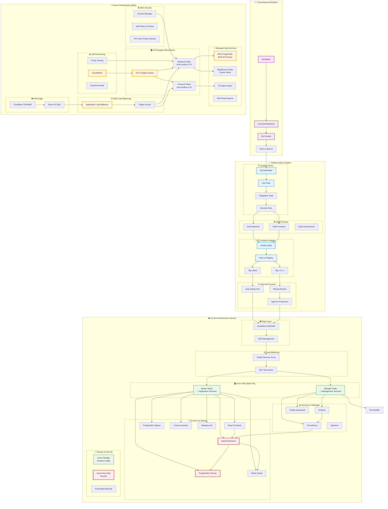
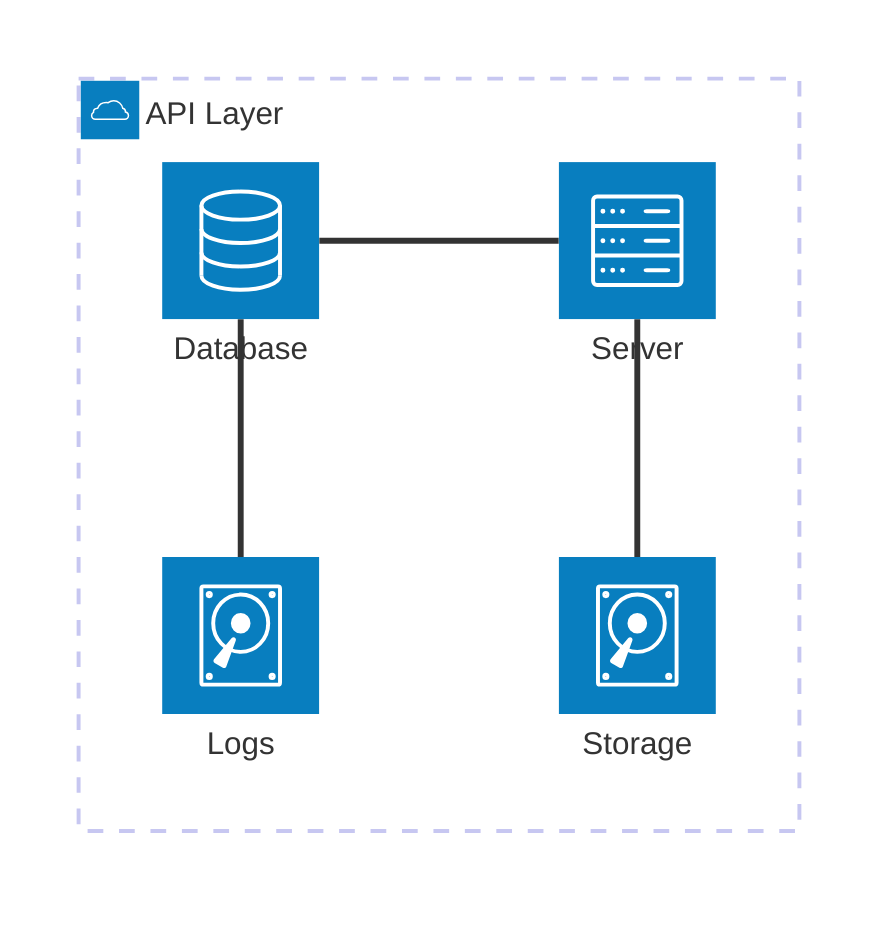
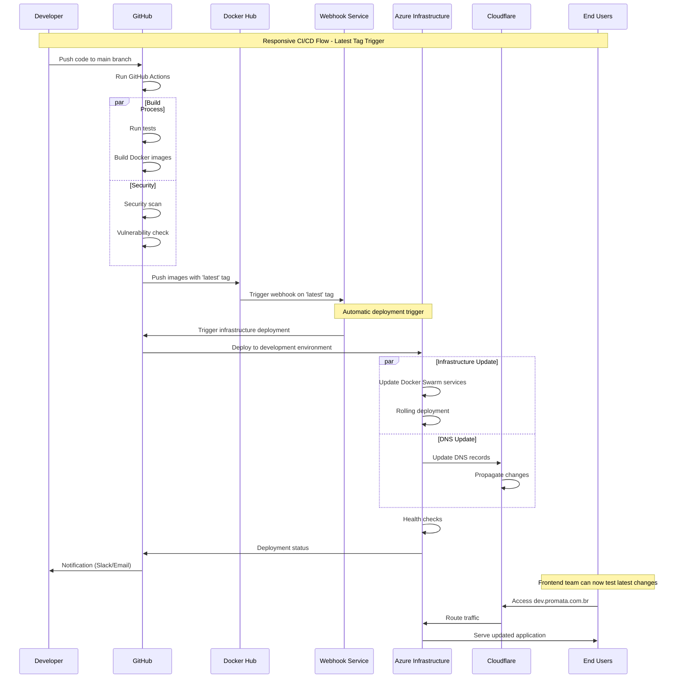

# CI/CD Flow Diagram - Template para Lucidchart

## Diagrama Completo do Fluxo CI/CD



## Diagrama de Arquitetura Detalhada



## Fluxo de Deployment Responsivo



## Comparação de Arquiteturas

```mermaid
gitgraph:
    options:
        "theme": "base"
    
    commit id: "Azure VMs (Current)"
    branch aws-migration
    commit id: "AWS Planning"
    commit id: "Infrastructure as Code"
    commit id: "ECS Fargate Setup"
    commit id: "RDS Migration"
    commit id: "Static IPs Config"
    
    checkout main
    commit id: "Production Stable"
    
    checkout aws-migration
    commit id: "Testing Phase"
    commit id: "Data Migration"
    
    checkout main
    merge aws-migration
    commit id: "AWS Production"
```

---

## Métricas de Comparação

| Aspecto | Azure Atual | AWS Futuro | Benefício |
|---------|-------------|------------|-----------|
| **Custo** | $200/mês | $150/mês | -25% |
| **Uptime** | 99.5% | 99.9% | +0.4% |
| **Scaling** | Manual | Auto | Automático |
| **Maintenance** | Alta | Baixa | Managed Services |
| **Response Time** | 2s | <500ms | -75% |

## Checklist de Migração

- [ ] **Phase 1**: Setup AWS Infrastructure (2 weeks)
  - [ ] Terraform AWS modules
  - [ ] ECS Fargate configuration
  - [ ] RDS setup with Multi-AZ
  - [ ] ElastiCache Redis cluster
  - [ ] Static IP allocation (Elastic IPs)

- [ ] **Phase 2**: Data Migration (1 week)
  - [ ] Database export from Azure
  - [ ] S3 data transfer
  - [ ] RDS import and validation
  - [ ] Application configuration update

- [ ] **Phase 3**: DNS Cutover (3 days)
  - [ ] Cloudflare configuration
  - [ ] IP address switch
  - [ ] Traffic monitoring
  - [ ] Rollback plan testing

- [ ] **Phase 4**: Optimization (1 week)
  - [ ] Performance tuning
  - [ ] Cost optimization
  - [ ] Monitoring setup
  - [ ] Documentation update